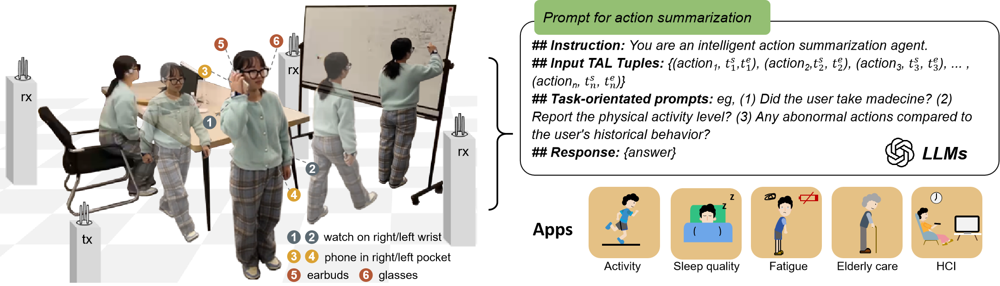

# XRFV2

<p align="center">
  
</p>


**XRF V2: A Dataset for Action Summarization with Wi-Fi Signals, and IMUs in Phones, Watches, Earbuds, and Glasses**

XRF V2 is a dataset designed for action summarization tasks using Wi-Fi signals and IMUs data from various devices such as phones, watches, earbuds, and glasses. This dataset provides valuable insights into human activity recognition and summarization using multi-modal sensor data.

**📊 Dataset Link**: [xxxx.kaggle.com](#)  
*(Currently, only data from 3 volunteers are available for access)*

## 📦 Environment Configuration

### 🛠️ Mamba Environment Setup:
Ensure that you are using the **CUDA 11.8** environment.

```bash
# Clone the video-mamba-suite repository
git clone --recursive https://github.com/OpenGVLab/video-mamba-suite.git

# Create and activate the environment
conda create -n video-mamba-suite python=3.9
conda activate video-mamba-suite

# Install PyTorch
pip install torch==2.1.2 torchvision==0.16.2 torchaudio==2.1.2 --index-url https://download.pytorch.org/whl/cu118

# Install required dependencies
pip install h5py pandas scipy torchinfo

# Install the requirements from requirement.txt
pip install -r requirement.txt

# Install causal-conv1d
cd causal-conv1d
# If setup.py fails, run the following:
CAUSAL_CONV1D_FORCE_BUILD=TRUE pip install .
cd ..

# Install mamba
cd mamba
python setup.py develop
cd ..
```
⚠️ If you encounter issues while installing `causal-conv1d`, please refer to [this setup issue fix](https://github.com/state-spaces/mamba/issues/40#issuecomment-1849095898).

## 🏃‍♂️ Running the Code:

1. Modify the paths in `basic_config.json` to match your system setup.
2. To **train** the model:
```bash
   python script/train_run.py
```
3. To **test** the model:

Copy the path of the trained model and specify it in `test_run.py` before running the test:

```
   test_model_list = [XXXXX]
```

```bash
   python script/test_run.py
```
## 📞 Support
If you encounter any issues or need assistance, feel free to reach out to us.

## 📝 TODO
- **Kinect Video Processing**: Process Kinect video data to extract pose and mesh information. This involves using Kinect's depth sensors and RGB cameras to capture human body movements and generate 3D mesh models. These models will be used for action recognition and summarization.
- **Use internvideo6b**: Leverage the internvideo6b model for efficient processing of the raw Kinect video frames to extract key pose and mesh features. This includes converting raw data into a usable format for training and testing, ensuring the model can handle multi-modal inputs like RGB images and depth maps for accurate action recognition.

## License 📜
XRFV2 is licensed under the MIT License. See the LICENSE file for more details.
